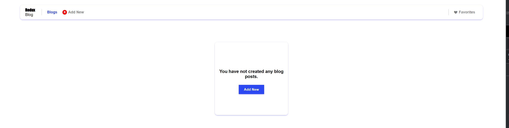
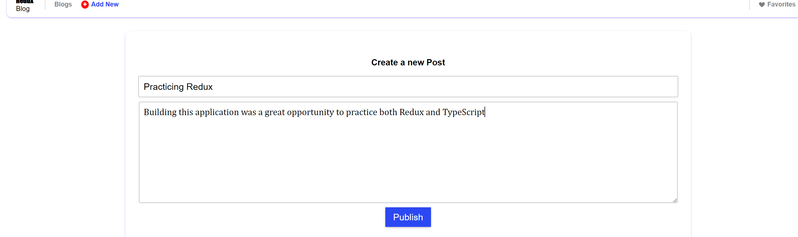

# Redux Blog Tutorial

## Table of contents

1. [License](#license)
2. [Description](#description)
3. [Installation](#installation)
4. [Usage](#usage)
5. [Packages](#packages)
6. [Features](#features)
7. [Resources](#resources)
8. [Tests](#tests)
9. [How to contribute](#how-to-contribute)
10. [Questions](#questions)

## License

Refer to <https://choosealicense.com/> for licensing information

## Description

1. Application description: This application is a fully functional, fully featured, frontend blog, built with Redux and React.
2. I built this app I built this blog to practice Redux and TypeScript and to expand on in the future.
3. This app This application not only gives users a simple, lightweight, blog application, but it also gives developers a easily readable, scalable template, to build out a blog or social media application with.

## Installation

The installation of this application is as simple as going to the URL.
 Refer to <https://docs.github.com/en/repositories/creating-and-managing-repositories/cloning-a-repository> for information on cloning a repository

## Usage

To use this application a user goes to the URL and clicks the the "Add New" button to write a post. Once a post or multiple posts are added a user can upvote or downvote posts on click, edit posts on click, delete posts on click, as well as favorite posts on click. Once a user has favorited a post they van click on their favorites tab in the navbar to see and interact with their favorite posts.

## Packages

undefined

## Features

This application gives the users the ability to write blog posts, edit those posts, like and dislike those posts, favorite and unfavorite those posts, as well as a section to view and interact with their favorites.

## Resources

To build this app I used TypeScript, Vite, React, Redux, Redux DevTools, and this tutorial <https://bejamas.io/blog/learn-modern-react-and-redux-in-2023-by-building-a-blog/?utm_source=Reddit&utm_medium=Social+media+post&utm_campaign=Reddit_Q1_testing>.

## Tests

A user can test this application by installing the vitest testing library or cloning this repository and running tests in the test section of the /src folder.

## How to Contribute

Other developers can contribute to this project by contacting me with any insights or ideas or forking this repository. Please follow github's contribution guidelineshttps://docs.github.com/en/communities/setting-up-your-project-for-healthy-contributions/setting-guidelines-for-repository-contributors

## Questions

For any further questions I'm avaialble at <mhgarry92@gmail.com>
To view and clone this project's repository as well as view other projects I'm working on visit <https://github.com/mhgarry>
